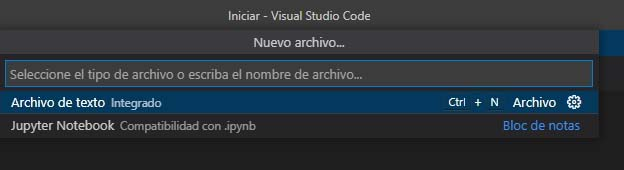
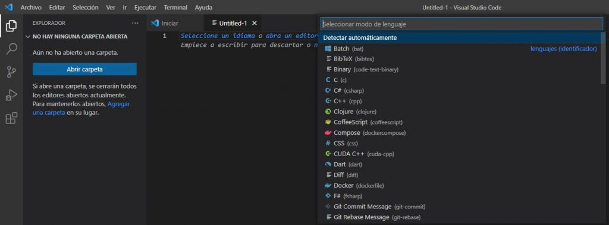

# Crear un documento HTML

Crear un archivo HTML en *Visual Studio Code* es un proceso sencillo y rápido

 - Abre Visual Studio Code: Inicia Visual Studio Code en tu sistema. Puedes descargarlo desde el sitio oficial si aún no lo tienes instalado.
 - Crea un nuevo archivo: Haz clic en «File» (Archivo) en la esquina superior izquierda. Después, selecciona «New File» (Nuevo Archivo).
    
 - Guarda el archivo con extensión HTML: Escribe tu código HTML en el nuevo archivo. Luego, guarda el archivo con una extensión «.html». Puedes hacerlo presionando Ctrl + S (o Cmd + S en Mac) y eligiendo la ubicación y el nombre del archivo.
    

